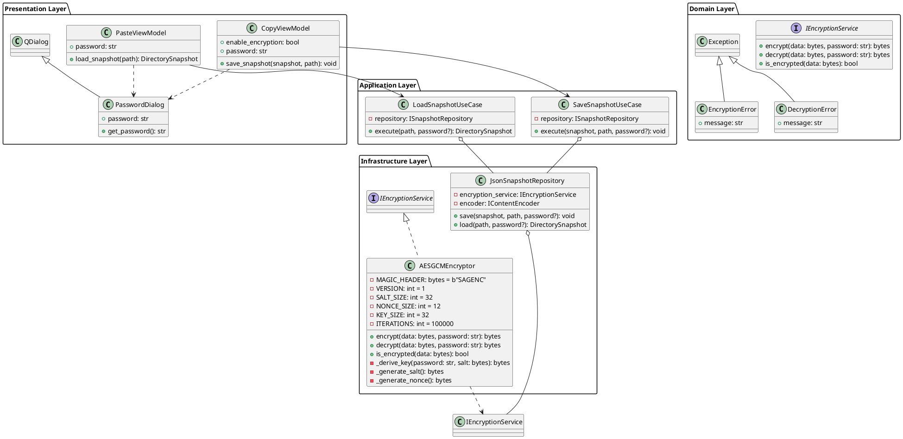

# 🔐 Encryption Feature Implementation Plan

## 📋 Overview

Add AES-256-GCM encryption to JSON snapshot files to protect sensitive data. Files will be unreadable without the correct password/key.

## 🎯 Goals

1. **Security**: Use industry-standard AES-256-GCM encryption
2. **Usability**: Simple password-based encryption
3. **Compatibility**: Backward compatible with unencrypted files
4. **Architecture**: Follow Clean Architecture principles
5. **Testability**: Full unit and integration test coverage

## 🏗️ Architecture Design

### Encryption Algorithm: AES-256-GCM

**Why AES-256-GCM?**
- ✅ Industry standard (NIST approved)
- ✅ Authenticated encryption (prevents tampering)
- ✅ Fast and secure
- ✅ Built into Python's `cryptography` library
- ✅ Provides confidentiality AND integrity

**Key Derivation: PBKDF2-HMAC-SHA256**
- Derives encryption key from user password
- Uses salt to prevent rainbow table attacks
- 100,000 iterations for security

### File Format

```
Encrypted JSON File Structure:
[MAGIC_HEADER][VERSION][SALT][NONCE][CIPHERTEXT][TAG]

- MAGIC_HEADER: "SAGENC" (6 bytes) - identifies encrypted file
- VERSION: 1 byte - encryption version for future compatibility
- SALT: 32 bytes - random salt for key derivation
- NONCE: 12 bytes - random nonce for AES-GCM
- CIPHERTEXT: Variable length - encrypted JSON data
- TAG: 16 bytes - authentication tag (included in ciphertext by GCM)
```

### UML Design



## 📁 File Structure

```
src/
├── domain/
│   └── interfaces/
│       └── encryption.py          # IEncryptionService interface
│
├── infrastructure/
│   └── encryption/
│       ├── __init__.py
│       └── aes_gcm_encryptor.py  # AES-256-GCM implementation
│
├── presentation/
│   └── views/
│       └── password_dialog.py     # Password input dialog
│
└── shared/
    └── exceptions.py              # Add encryption exceptions

tests/
├── unit/
│   ├── infrastructure/
│   │   └── test_aes_encryptor.py
│   └── integration/
│       └── test_encryption_flow.py
```

## 🔄 Implementation Steps

### Step 1: Design First (REQUIRED)
**Status:** ⏳ Pending approval

Generate UML diagrams showing:
1. Class structure with encryption components
2. Sequence diagram for encrypt flow
3. Sequence diagram for decrypt flow
4. Integration with existing architecture

**Wait for user approval before proceeding!**

---

### Step 2: Add Dependencies
```bash
pip install cryptography
```

Update `requirements.txt`:
```
PySide6>=6.4.0
cryptography>=41.0.0
```

---

### Step 3: Domain Layer - Create Interface

**File:** `src/domain/interfaces/encryption.py`

```python
"""Encryption service interface."""

from abc import ABC, abstractmethod


class IEncryptionService(ABC):
    """Interface for encryption/decryption services."""
    
    @abstractmethod
    def encrypt(self, data: bytes, password: str) -> bytes:
        """
        Encrypt data with password.
        
        Args:
            data: Raw data to encrypt
            password: User password for encryption
            
        Returns:
            Encrypted data with metadata
            
        Raises:
            EncryptionError: If encryption fails
        """
        pass
    
    @abstractmethod
    def decrypt(self, encrypted_data: bytes, password: str) -> bytes:
        """
        Decrypt data with password.
        
        Args:
            encrypted_data: Encrypted data with metadata
            password: User password for decryption
            
        Returns:
            Decrypted raw data
            
        Raises:
            DecryptionError: If decryption fails or password wrong
        """
        pass
    
    @abstractmethod
    def is_encrypted(self, data: bytes) -> bool:
        """
        Check if data is encrypted.
        
        Args:
            data: Data to check
            
        Returns:
            True if encrypted, False otherwise
        """
        pass
```

**Update:** `src/shared/exceptions.py`

```python
# Add new exceptions
class EncryptionError(SagittariusError):
    """Raised when encryption fails."""
    pass


class DecryptionError(SagittariusError):
    """Raised when decryption fails."""
    pass


class InvalidPasswordError(DecryptionError):
    """Raised when password is incorrect."""
    pass
```

---

### Step 4: Infrastructure - Implement AES-GCM

**File:** `src/infrastructure/encryption/aes_gcm_encryptor.py`

```python
"""AES-256-GCM encryption implementation."""

import os
import secrets
from cryptography.hazmat.primitives.ciphers.aead import AESGCM
from cryptography.hazmat.primitives.kdf.pbkdf2 import PBKDF2HMAC
from cryptography.hazmat.primitives import hashes
from cryptography.hazmat.backends import default_backend

from ...domain.interfaces.encryption import IEncryptionService
from ...shared.exceptions import EncryptionError, DecryptionError, InvalidPasswordError


class AESGCMEncryptor(IEncryptionService):
    """AES-256-GCM encryption with PBKDF2 key derivation."""
    
    # File format constants
    MAGIC_HEADER = b"SAGENC"  # 6 bytes
    VERSION = 1  # 1 byte
    SALT_SIZE = 32  # bytes
    NONCE_SIZE = 12  # bytes (96 bits for GCM)
    KEY_SIZE = 32  # bytes (256 bits)
    PBKDF2_ITERATIONS = 100000
    
    def encrypt(self, data: bytes, password: str) -> bytes:
        """Encrypt data using AES-256-GCM."""
        try:
            # Generate random salt and nonce
            salt = secrets.token_bytes(self.SALT_SIZE)
            nonce = secrets.token_bytes(self.NONCE_SIZE)
            
            # Derive key from password
            key = self._derive_key(password, salt)
            
            # Encrypt with AES-GCM
            aesgcm = AESGCM(key)
            ciphertext = aesgcm.encrypt(nonce, data, None)
            
            # Build encrypted file format
            encrypted_data = (
                self.MAGIC_HEADER +
                bytes([self.VERSION]) +
                salt +
                nonce +
                ciphertext
            )
            
            return encrypted_data
            
        except Exception as e:
            raise EncryptionError(f"Encryption failed: {str(e)}")
    
    def decrypt(self, encrypted_data: bytes, password: str) -> bytes:
        """Decrypt data using AES-256-GCM."""
        try:
            # Verify magic header
            if not self.is_encrypted(encrypted_data):
                raise DecryptionError("Not an encrypted file")
            
            # Parse encrypted file format
            offset = len(self.MAGIC_HEADER)
            version = encrypted_data[offset]
            offset += 1
            
            if version != self.VERSION:
                raise DecryptionError(f"Unsupported version: {version}")
            
            salt = encrypted_data[offset:offset + self.SALT_SIZE]
            offset += self.SALT_SIZE
            
            nonce = encrypted_data[offset:offset + self.NONCE_SIZE]
            offset += self.NONCE_SIZE
            
            ciphertext = encrypted_data[offset:]
            
            # Derive key from password
            key = self._derive_key(password, salt)
            
            # Decrypt with AES-GCM
            aesgcm = AESGCM(key)
            plaintext = aesgcm.decrypt(nonce, ciphertext, None)
            
            return plaintext
            
        except InvalidPasswordError:
            raise
        except DecryptionError:
            raise
        except Exception as e:
            # Most likely wrong password (authentication failed)
            raise InvalidPasswordError("Invalid password or corrupted file")
    
    def is_encrypted(self, data: bytes) -> bool:
        """Check if data starts with encryption magic header."""
        return data.startswith(self.MAGIC_HEADER)
    
    def _derive_key(self, password: str, salt: bytes) -> bytes:
        """Derive encryption key from password using PBKDF2."""
        kdf = PBKDF2HMAC(
            algorithm=hashes.SHA256(),
            length=self.KEY_SIZE,
            salt=salt,
            iterations=self.PBKDF2_ITERATIONS,
            backend=default_backend()
        )
        return kdf.derive(password.encode('utf-8'))
```

---

### Step 5: Update Repository for Encryption

**Update:** `src/infrastructure/persistence/json_repository.py`

Add encryption support:

```python
def __init__(self, encoder: IContentEncoder, 
             encryption_service: Optional[IEncryptionService] = None):
    self._encoder = encoder
    self._encryption_service = encryption_service

def save(self, snapshot: DirectorySnapshot, file_path: str, 
         password: Optional[str] = None) -> None:
    """Save with optional encryption."""
    # Convert to JSON
    json_str = json.dumps(data, indent=2)
    json_bytes = json_str.encode('utf-8')
    
    # Encrypt if password provided
    if password and self._encryption_service:
        json_bytes = self._encryption_service.encrypt(json_bytes, password)
    
    # Write to file
    with open(file_path, 'wb') as f:
        f.write(json_bytes)

def load(self, file_path: str, password: Optional[str] = None) -> DirectorySnapshot:
    """Load with automatic encryption detection."""
    with open(file_path, 'rb') as f:
        data = f.read()
    
    # Check if encrypted
    if self._encryption_service and self._encryption_service.is_encrypted(data):
        if not password:
            raise DecryptionError("File is encrypted, password required")
        data = self._encryption_service.decrypt(data, password)
    
    # Parse JSON
    json_str = data.decode('utf-8')
    dict_data = json.loads(json_str)
    return DirectorySnapshot.from_dict(dict_data)
```

---

### Step 6: Update Use Cases

**Update:** `src/application/use_cases/save_snapshot.py`

```python
def execute(self, snapshot: DirectorySnapshot, output_path: str,
            password: Optional[str] = None) -> None:
    """Save snapshot with optional encryption."""
    self._repository.save(snapshot, output_path, password)
```

**Update:** `src/application/use_cases/load_snapshot.py`

```python
def execute(self, file_path: str, password: Optional[str] = None) -> DirectorySnapshot:
    """Load snapshot with optional decryption."""
    return self._repository.load(file_path, password)
```

---

### Step 7: Add UI for Password Input

**File:** `src/presentation/views/password_dialog.py`

```python
"""Password input dialog."""

from PySide6.QtWidgets import (
    QDialog, QVBoxLayout, QLabel, QLineEdit, 
    QPushButton, QHBoxLayout, QCheckBox
)
from PySide6.QtCore import Qt


class PasswordDialog(QDialog):
    """Dialog for password input."""
    
    def __init__(self, title: str = "Enter Password", 
                 confirm: bool = False, parent=None):
        super().__init__(parent)
        self.setWindowTitle(title)
        self.setMinimumWidth(400)
        self._confirm = confirm
        self._setup_ui()
    
    def _setup_ui(self):
        layout = QVBoxLayout(self)
        
        # Instructions
        label = QLabel("Enter encryption password:")
        layout.addWidget(label)
        
        # Password input
        self.password_input = QLineEdit()
        self.password_input.setEchoMode(QLineEdit.Password)
        self.password_input.setPlaceholderText("Password")
        layout.addWidget(self.password_input)
        
        # Confirm password (for encryption)
        if self._confirm:
            self.confirm_input = QLineEdit()
            self.confirm_input.setEchoMode(QLineEdit.Password)
            self.confirm_input.setPlaceholderText("Confirm password")
            layout.addWidget(self.confirm_input)
        
        # Show password checkbox
        self.show_password_cb = QCheckBox("Show password")
        self.show_password_cb.toggled.connect(self._toggle_password_visibility)
        layout.addWidget(self.show_password_cb)
        
        # Buttons
        button_layout = QHBoxLayout()
        
        ok_btn = QPushButton("OK")
        ok_btn.clicked.connect(self._on_ok)
        ok_btn.setDefault(True)
        
        cancel_btn = QPushButton("Cancel")
        cancel_btn.clicked.connect(self.reject)
        
        button_layout.addStretch()
        button_layout.addWidget(ok_btn)
        button_layout.addWidget(cancel_btn)
        
        layout.addLayout(button_layout)
    
    def _toggle_password_visibility(self, checked: bool):
        mode = QLineEdit.Normal if checked else QLineEdit.Password
        self.password_input.setEchoMode(mode)
        if self._confirm:
            self.confirm_input.setEchoMode(mode)
    
    def _on_ok(self):
        password = self.password_input.text()
        
        if not password:
            QMessageBox.warning(self, "Error", "Password cannot be empty")
            return
        
        if self._confirm:
            confirm = self.confirm_input.text()
            if password != confirm:
                QMessageBox.warning(self, "Error", "Passwords do not match")
                return
        
        self.accept()
    
    def get_password(self) -> str:
        """Get entered password."""
        return self.password_input.text()
```

---

### Step 8: Update ViewModels

**Update:** `src/presentation/view_models/copy_view_model.py`

Add encryption checkbox and password handling.

**Update:** `src/presentation/view_models/paste_view_model.py`

Add password prompt when loading encrypted files.

---

### Step 9: Update Widgets

**Update:** `src/presentation/views/copy_widget.py`

Add:
- "Enable Encryption" checkbox
- Password dialog prompt when saving with encryption

**Update:** `src/presentation/views/paste_widget.py`

Add:
- Automatic detection of encrypted files
- Password dialog prompt when loading

---

### Step 10: Update DI Container

**Update:** `src/di_container.py`

```python
def get_encryption_service(self) -> IEncryptionService:
    if self._encryption_service is None:
        from src.infrastructure.encryption.aes_gcm_encryptor import AESGCMEncryptor
        self._encryption_service = AESGCMEncryptor()
    return self._encryption_service

def get_snapshot_repository(self) -> ISnapshotRepository:
    if self._snapshot_repository is None:
        from src.infrastructure.persistence.json_repository import JsonSnapshotRepository
        self._snapshot_repository = JsonSnapshotRepository(
            self.get_encoder(),
            self.get_encryption_service()  # Add encryption
        )
    return self._snapshot_repository
```

---

### Step 11: Unit Tests

**File:** `tests/unit/infrastructure/test_aes_encryptor.py`

Test cases:
- Encrypt and decrypt successfully
- Wrong password raises error
- Detect encrypted data
- Handle corrupted data
- Verify salt randomness
- Verify nonce randomness

---

### Step 12: Integration Tests

**File:** `tests/integration/test_encryption_flow.py`

Test cases:
- Full workflow with encryption
- Save encrypted, load encrypted
- Backward compatibility (load unencrypted)
- Wrong password error handling
- File corruption detection

---

### Step 13: Documentation

Update:
- `README.md` - Add encryption feature
- `docs/architecture.md` - Add encryption layer
- `QUICKSTART.md` - Add encryption usage
- `TEST_RESULTS.md` - Add encryption test results

---

## 🔒 Security Considerations

### What This Provides
✅ **Confidentiality** - Data is unreadable without password  
✅ **Integrity** - Tampering is detected (GCM authentication)  
✅ **Industry Standard** - AES-256-GCM (NIST approved)  
✅ **Password Protection** - PBKDF2 with 100k iterations

### What This Does NOT Provide
⚠️ **Key Management** - User must remember password (no recovery)  
⚠️ **Multi-User** - Single password per file  
⚠️ **Network Security** - Only protects stored files  
⚠️ **Metadata Protection** - File size visible

### Best Practices
1. Use strong passwords (12+ characters, mixed case, numbers, symbols)
2. Store password securely (password manager)
3. No password recovery - lost password = lost data
4. Regular backups of unencrypted files (optional)

---

## 📊 Testing Strategy

### Unit Tests (Target: 95%+ coverage)
- ✅ Encryption service implementation
- ✅ Key derivation
- ✅ Error handling
- ✅ Edge cases

### Integration Tests
- ✅ Full encrypt/decrypt workflow
- ✅ Backward compatibility
- ✅ UI interaction
- ✅ Error scenarios

### Manual Tests
- ✅ Create encrypted snapshot
- ✅ Load encrypted snapshot
- ✅ Wrong password handling
- ✅ Mixed encrypted/unencrypted files
- ✅ Performance with large files

---

## 🚀 Rollout Plan

### Phase 1: Implementation (This Plan)
1. Design approval
2. Core encryption implementation
3. Repository integration
4. Unit tests

### Phase 2: UI Integration
1. Password dialogs
2. ViewModel updates
3. Widget updates
4. Manual testing

### Phase 3: Testing & Documentation
1. Integration tests
2. Documentation updates
3. Build verification
4. User guide

### Phase 4: Release
1. Version bump to 2.1.0
2. Git commit and push
3. Create release notes
4. Build executable

---

## ✅ Acceptance Criteria

- [ ] AES-256-GCM encryption implemented
- [ ] Password-based key derivation working
- [ ] Backward compatible with unencrypted files
- [ ] UI for password input
- [ ] Automatic encryption detection
- [ ] Unit test coverage > 95%
- [ ] Integration tests passing
- [ ] Documentation updated
- [ ] Executable builds successfully
- [ ] No performance degradation

---

## 🎯 Success Metrics

1. **Security**: Encrypted files unreadable without password
2. **Usability**: Simple checkbox + password dialog
3. **Performance**: < 500ms overhead for typical files
4. **Reliability**: 100% test pass rate
5. **Compatibility**: Works with existing unencrypted files

---

**Status:** 📋 PLAN READY - Awaiting Design Approval  
**Next Step:** Generate UML diagrams and get user confirmation
