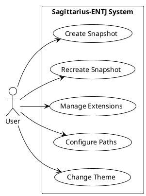
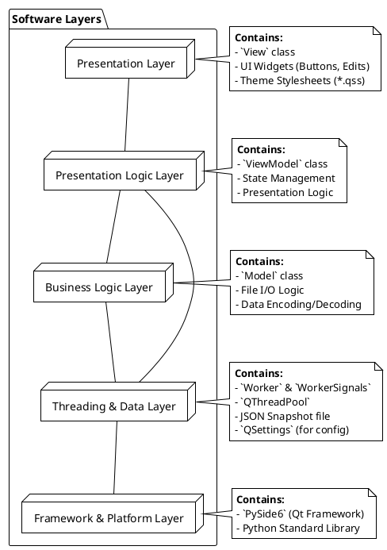
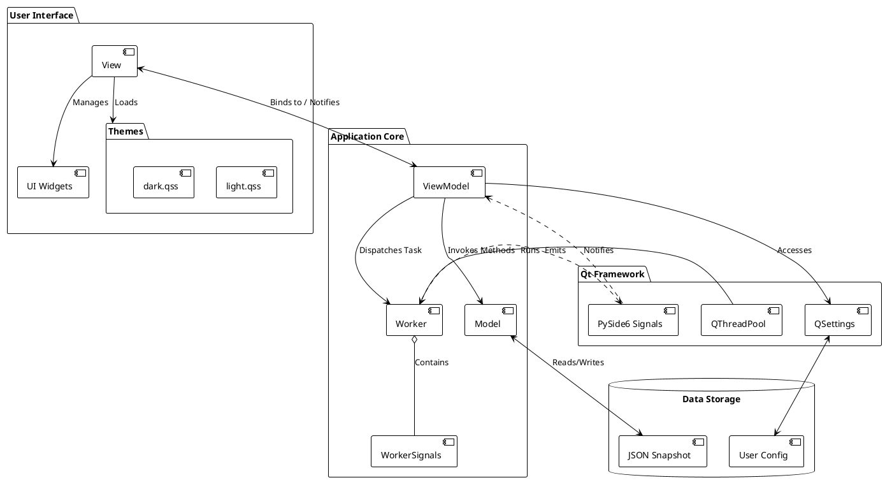

# Software Architecture Document (SAD) for Sagittarius-ENTJ

## 1. Introduction

### 1.1 Purpose
This document provides a comprehensive and detailed architectural overview of the Sagittarius-ENTJ application. It details the chosen architectural style, the decomposition of the system into its primary components and layers, and the interactions between them.

### 1.2 Scope
The scope of this document is the high-level architecture of the Sagittarius-ENTJ application. It covers the system's decomposition from multiple perspectives, including use cases, logical layers, and components.

### 1.3 Definitions, Acronyms, and Abbreviations
- **MVVM**: Model-View-ViewModel
- **QSS**: Qt Style Sheets
- **Component**: A logical and replaceable part of the system.
- **Layer**: A horizontal slice of the architecture that deals with a specific concern.

---

## 2. Architectural Representation

The application's design is centered around the **Model-View-ViewModel (MVVM)** pattern, which promotes a clean separation of concerns. This architecture is further described through a series of views, including the use case view, a logical layered view, and a component view.

---

## 3. Use Case View

This view illustrates the interactions between the primary actor (the User) and the main functions (use cases) of the Sagittarius-ENTJ application.

### 3.1 Use Case Diagram

### 3.2 Use Case Descriptions
- **Create Snapshot**: The user selects a source directory, an output JSON path, and a set of file extensions, then initiates the process to create a snapshot file.
- **Recreate Snapshot**: The user selects an existing JSON snapshot file and a target output directory, then initiates the process to recreate the files and folders.
- **Manage Extensions**: The user adds or removes file extensions to be included in the snapshot.
- **Configure Paths**: The user selects and modifies the source and destination paths for operations.
- **Change Theme**: The user selects a visual theme (e.g., Light, Dark) from the UI.

---

## 4. Logical (Layered) View

The application is structured into distinct logical layers, where each layer has a specific responsibility and communicates only with the layers adjacent to it.

### 4.1 Software Layer Diagram

---

## 5. Component View

This view provides a more detailed breakdown of the system's components and their dependencies.

### 5.1 Detailed Component Diagram

---

## 6. Architectural Goals and Constraints

- **Maintainability**: The primary goal of the MVVM architecture and layered approach is to make the codebase easy to understand, modify, and extend.
- **Testability**: By decoupling the logic from the UI, the core functionality can be unit-tested independently of the GUI.
- **Responsiveness**: The use of a `QThreadPool` and `Worker` component ensures the GUI remains responsive during file I/O operations.
- **Cross-Platform**: The architecture is platform-agnostic. All platform-specific details are abstracted by the Qt framework and Python standard libraries.