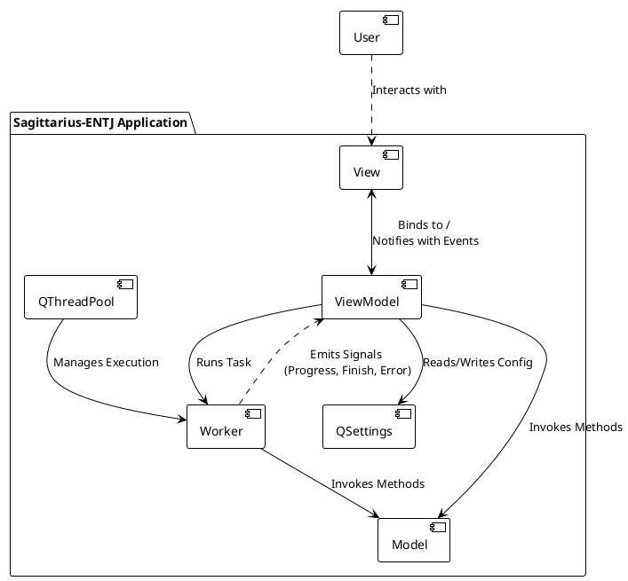
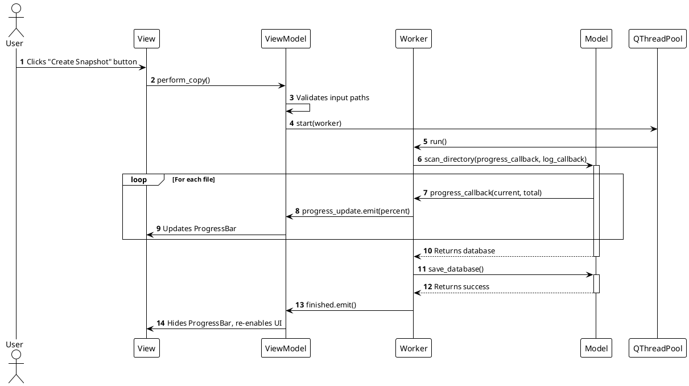

# Software Architecture Document (SAD) for Sagittarius-ENTJ

## 1. Introduction

### 1.1 Purpose
This document provides a comprehensive architectural overview of the Sagittarius-ENTJ application. It details the chosen architectural style, the decomposition of the system into its primary components, and the interactions between them. This document is intended for developers, architects, and anyone interested in the technical design of the application.

### 1.2 Scope
The scope of this document is the architecture of the Sagittarius-ENTJ application. This includes the definition of the Model-View-ViewModel (MVVM) pattern as implemented, the roles of the main software components, and the key data and control flows. It does not cover detailed class design, which is addressed in the Software Design Document (SDD).

### 1.3 Definitions, Acronyms, and Abbreviations
- **MVVM**: Model-View-ViewModel, a software architectural pattern.
- **QSS**: Qt Style Sheets, used for styling the application.
- **Component**: A logical block of the system with a well-defined responsibility.

---

## 2. Architectural Representation

The application employs the **Model-View-ViewModel (MVVM)** architectural pattern. This choice was made to enforce a strong separation of concerns between the user interface (View), the application's data and business logic (Model), and the presentation logic that connects them (ViewModel).

- **Model**: Represents the application's data and business logic. It is completely UI-agnostic and handles tasks like scanning the file system, encoding/decoding files, and managing the data structure.
- **View**: Represents the UI. It is responsible for displaying data and capturing user input. It is designed to be as "dumb" as possible, delegating all logic to the ViewModel.
- **ViewModel**: Acts as the intermediary between the Model and the View. It handles presentation logic, manages the application's state, and exposes data from the Model to the View in a display-friendly format. It also handles user actions from the View and passes them to the Model.
- **Worker**: A supplementary component that executes long-running tasks (e.g., file scanning) in a separate thread to prevent the GUI from freezing. It communicates back to the ViewModel using Qt's signals and slots mechanism.

---

## 3. Architectural Views

### 3.1 Component Diagram

This diagram illustrates the primary components of the application and their relationships.

### 3.2 "Create Snapshot" Sequence Diagram

This diagram shows the sequence of interactions when a user initiates the "Create Snapshot" (Copy) operation.

### 3.3 Data Flow

1.  **Configuration Data**: User settings (paths, extensions, theme) are entered in the `View`. The `ViewModel` saves these to disk via `QSettings`. On startup, the `ViewModel` loads these settings and populates the `View`.
2.  **Snapshot Creation**: The `View` triggers the operation. The `ViewModel` gets the source path and extensions, then dispatches a `Worker` thread. The `Worker` calls the `Model` to scan the file system. The `Model` reads files, encodes them, and builds a database in memory. This database is then saved to a JSON file by the `Model`.
3.  **Snapshot Recreation**: The `View` triggers the operation. The `ViewModel` gets the JSON path and output directory, then dispatches a `Worker`. The `Worker` calls the `Model` to load the JSON file into memory. The `Model` then iterates through the in-memory database, creating directories and writing decoded files to the specified output location.
4.  **UI Feedback**: During long operations, the `Model` calls progress callbacks passed in by the `Worker`. The `Worker` translates these into Qt signals (`progress_update`, `log_message`), which are emitted to the `ViewModel`. The `ViewModel`, in turn, emits its own signals (`progress_changed`, `message_logged`) that the `View` is connected to, allowing the UI to update in real-time.

---

## 4. Architectural Goals and Constraints

- **Maintainability**: The primary goal of the MVVM architecture is to make the codebase easy to understand, modify, and extend. The separation of concerns is key to achieving this.
- **Testability**: By decoupling the logic (ViewModel, Model) from the UI (View), the core functionality can be unit-tested independently of the GUI.
- **Responsiveness**: The use of a `QThreadPool` and `Worker` objects ensures the GUI remains responsive during file I/O operations, which is a critical non-functional requirement.
- **Cross-Platform**: The architecture is platform-agnostic. All platform-specific details are handled by the underlying Qt framework and Python standard libraries, allowing the same codebase to be built for Windows and Linux.