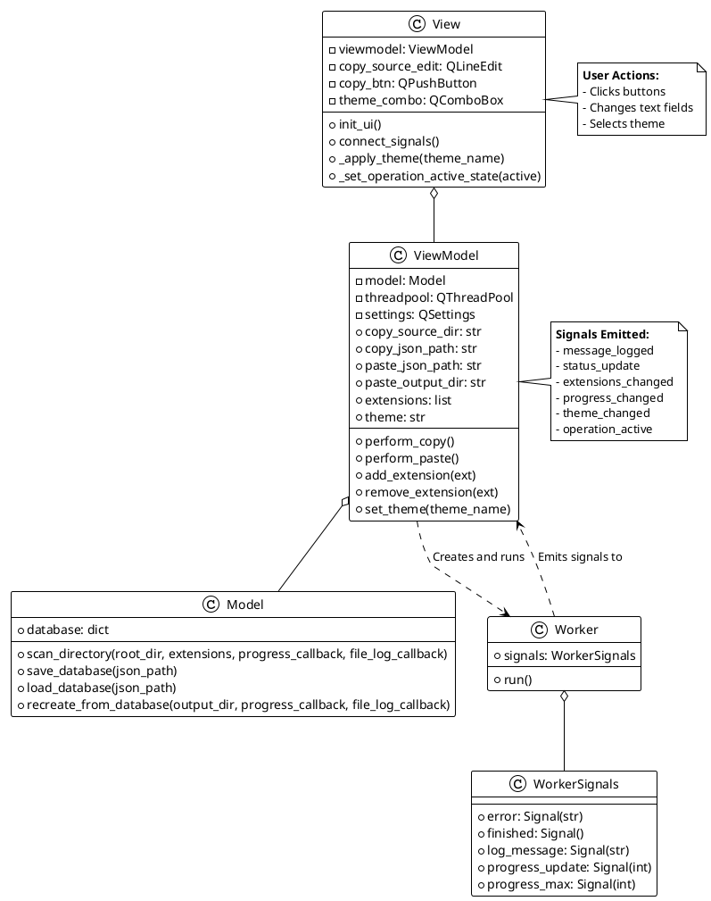

# Software Design Document (SDD) for Sagittarius-ENTJ

## 1. Introduction

### 1.1 Purpose
This document provides a detailed design description for the Sagittarius-ENTJ application. It elaborates on the architectural components defined in the Software Architecture Document (SAD), detailing the design of each class, its methods, properties, and the data structures used.

### 1.2 Scope
This document covers the low-level design of the following components:
- `Model`
- `ViewModel`
- `View`
- `Worker` and `WorkerSignals`
It also specifies the structure of the JSON data format used for snapshots.

---

## 2. System Design Overview

The application is composed of five main classes that work together to implement the MVVM pattern. The `View` interacts with the user, the `ViewModel` manages state and presentation logic, the `Model` handles data and business logic, and the `Worker` offloads long-running tasks from the main UI thread.

### 2.1 Class Diagram

This diagram shows the classes, their key properties and methods, and their relationships.



---

## 3. Detailed Component Design

### 3.1 `Model` Class
- **Purpose**: To manage the application's data and core business logic. It is entirely independent of the UI.
- **Responsibilities**:
    - Scanning a directory structure based on specified file extensions.
    - Reading file contents and encoding them to Base64.
    - Storing the directory structure and file data in an in-memory dictionary.
    - Saving this dictionary to a JSON file.
    - Loading a JSON file into the in-memory dictionary.
    - Recreating the directory structure and files from the in-memory dictionary.
- **Public Methods**:
    - `scan_directory(root_dir, extensions, progress_callback, file_log_callback)`: Walks a directory, filters files, and populates the internal database.
    - `save_database(json_path)`: Serializes the internal database to a JSON file.
    - `load_database(json_path)`: Deserializes a JSON file into the internal database.
    - `recreate_from_database(output_dir, progress_callback, file_log_callback)`: Writes the contents of the database to the file system.

### 3.2 `ViewModel` Class
- **Purpose**: To act as the bridge between the `Model` and the `View`. It holds the application's state and presentation logic.
- **Responsibilities**:
    - Holding the application's state (e.g., current paths, extension list, selected theme).
    - Persisting and retrieving user settings (`QSettings`).
    - Validating user input (e.g., checking if paths are valid).
    - Initiating operations (Copy/Paste) by creating and running a `Worker` task on a background thread.
    - Exposing data and state to the `View` through properties and signals.
    - Providing slots for the `View` to call in response to user actions.
- **Public Properties**:
    - `copy_source_dir`, `copy_json_path`, `paste_json_path`, `paste_output_dir`: Get/set path configurations.
    - `extensions`: Gets the list of file extensions.
    - `theme`: Gets/sets the current UI theme.
- **Public Slots/Methods**:
    - `perform_copy()`: Starts the snapshot creation process.
    - `perform_paste()`: Starts the snapshot recreation process.
    - `add_extension(ext)`, `remove_extension(ext)`: Manage the extension list.
    - `set_theme(theme_name)`: Updates the application theme.

### 3.3 `View` Class
- **Purpose**: To present the user interface and capture user input.
- **Responsibilities**:
    - Creating and arranging all GUI widgets (buttons, line edits, etc.).
    - Connecting widget events (e.g., `clicked`, `textChanged`) to slots in the `ViewModel`.
    - Subscribing to signals from the `ViewModel` to update the UI (e.g., update a progress bar, display a log message, change the theme).
    - Loading and applying QSS stylesheets for theming.
    - Showing file dialogs to the user for path selection.
- **Key Methods**:
    - `init_ui()`: Creates the layout and all widgets.
    - `connect_signals()`: Establishes all signal-slot connections between the View and ViewModel.
    - `load_initial_data()`: Populates the UI with data from the ViewModel on startup.
    - `_apply_theme(theme_name)`: Slot to load and apply a QSS file.
    - `_set_operation_active_state(active)`: Slot to enable/disable UI controls during long operations.

### 3.4 `Worker` and `WorkerSignals` Classes
- **Purpose**: To execute a function on a background thread and communicate the results back to the main thread in a thread-safe manner.
- **`WorkerSignals` Responsibilities**:
    - Defines the set of signals that a `Worker` can emit (`finished`, `error`, `progress_update`, etc.). This decouples the `Worker` from the `ViewModel`.
- **`Worker` Responsibilities**:
    - Accepts a function to execute in its constructor.
    - Implements the `run()` method, which is executed by the `QThreadPool`.
    - Wraps the execution of the task function in a `try...except...finally` block to handle errors and ensure the `finished` signal is always emitted.
    - Passes callback functions to the task that can be used to emit signals for progress and logging.

---

## 4. Data Design

### 4.1 JSON Snapshot Data Structure
The snapshot file is a JSON object with two main keys: `directories` and `files`.

```json
{
  "directories": [
    "dir1",
    "dir1/subdir"
  ],
  "files": [
    {
      "path": "file1.txt",
      "content_base64": "VGhpcyBpcyBmaWxlMS4="
    },
    {
      "path": "dir1/file2.py",
      "content_base64": "cHJpbnQoJ0hlbGxvJyk="
    }
  ]
}
```

- **`directories`**: An array of strings, where each string is a relative path to a subdirectory within the source directory.
- **`files`**: An array of objects, where each object represents a single file and contains:
    - **`path`**: A string representing the relative path of the file.
    - **`content_base64`**: A string containing the Base64-encoded content of the file.