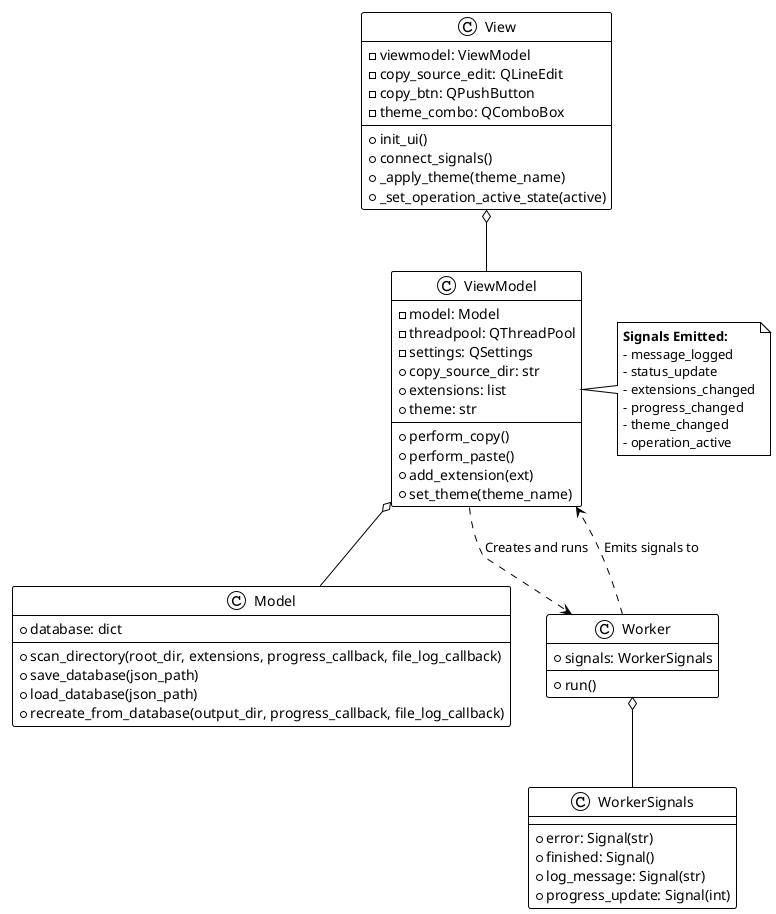
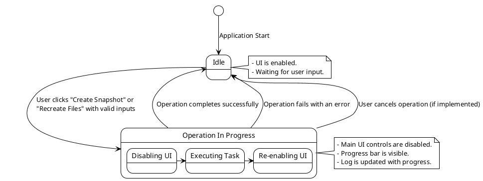
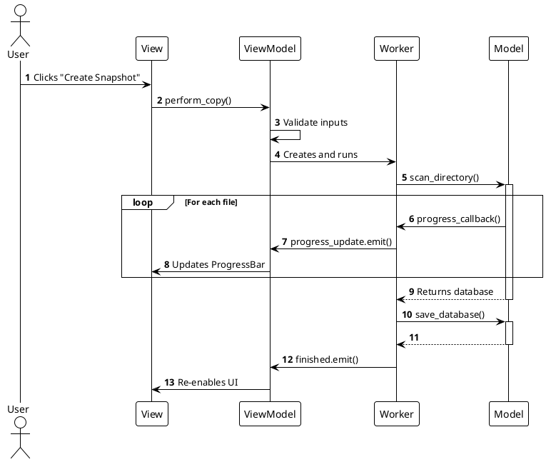
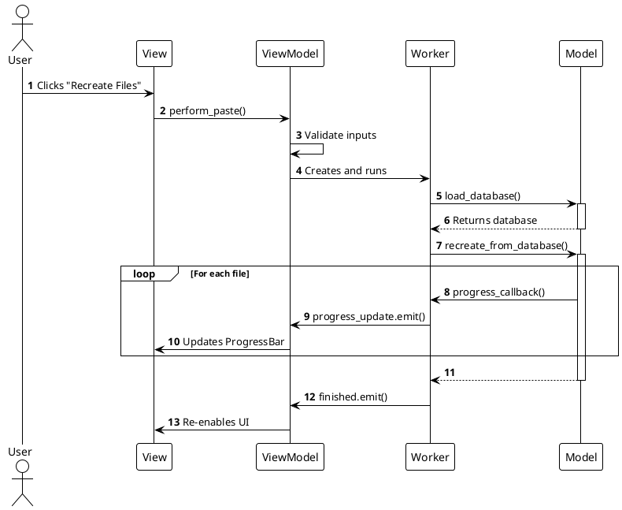

# Software Design Document (SDD) for Sagittarius-ENTJ

## 1. Introduction

### 1.1 Purpose
This document provides a detailed design description for the Sagittarius-ENTJ application. It elaborates on the architectural components defined in the Software Architecture Document (SAD), detailing the design of each class, its methods, properties, and the data structures used.

### 1.2 Scope
This document covers the detailed, low-level design of the `Model`, `ViewModel`, `View`, and `Worker` components. It includes class diagrams, state diagrams, and sequence diagrams to fully illustrate the system's static structure and dynamic behavior.

---

## 2. System Design Overview

The application is composed of five main classes that work together to implement the MVVM pattern. The `View` interacts with the user, the `ViewModel` manages state and presentation logic, the `Model` handles data and business logic, and the `Worker` offloads long-running tasks from the main UI thread.

### 2.1 Class Diagram

This diagram shows the classes, their key attributes and methods, and their relationships.



### 2.2 Application State Diagram
This diagram illustrates the primary states of the application from the user's perspective.



---

## 3. Dynamic Behavior

This section provides sequence diagrams to illustrate the dynamic interactions between components for the main use cases.

### 3.1 "Create Snapshot" Sequence Diagram



### 3.2 "Recreate Snapshot" Sequence Diagram



---

## 4. Detailed Component Design

### 4.1 `Model` Class
- **Purpose**: To manage the application's data and core business logic. It is entirely independent of the UI.
- **Responsibilities**:
    - Scanning a directory structure based on specified file extensions.
    - Reading file contents and encoding them to Base64.
    - Storing the directory structure and file data in an in-memory dictionary.
    - Saving this dictionary to a JSON file.
    - Loading a JSON file into the in-memory dictionary.
    - Recreating the directory structure and files from the in-memory dictionary.

### 4.2 `ViewModel` Class
- **Purpose**: To act as the bridge between the `Model` and the `View`. It holds the application's state and presentation logic.
- **Responsibilities**:
    - Holding the application's state (e.g., current paths, extension list, selected theme).
    - Persisting and retrieving user settings (`QSettings`).
    - Validating user input.
    - Initiating operations by creating and running a `Worker` task.
    - Exposing data and state to the `View` through properties and signals.

### 4.3 `View` Class
- **Purpose**: To present the user interface and capture user input.
- **Responsibilities**:
    - Creating and arranging all GUI widgets.
    - Connecting widget events to slots in the `ViewModel`.
    - Subscribing to signals from the `ViewModel` to update the UI.
    - Loading and applying QSS stylesheets for theming.

### 4.4 `Worker` and `WorkerSignals` Classes
- **Purpose**: To execute a function on a background thread and communicate the results back to the main thread in a thread-safe manner.
- **Responsibilities**:
    - **WorkerSignals**: Defines the set of signals a `Worker` can emit (`finished`, `error`, `progress_update`).
    - **Worker**: Executes a given task function in its `run()` method, wrapping it in error handling and ensuring signals are emitted correctly.

---

## 5. Data Design

### 5.1 JSON Snapshot Data Structure
The snapshot file is a JSON object with two main keys: `directories` and `files`.

```json
{
  "directories": [
    "dir1",
    "dir1/subdir"
  ],
  "files": [
    {
      "path": "file1.txt",
      "content_base64": "VGhpcyBpcyBmaWxlMS4="
    },
    {
      "path": "dir1/file2.py",
      "content_base64": "cHJpbnQoJ0hlbGxvJyk="
    }
  ]
}
```